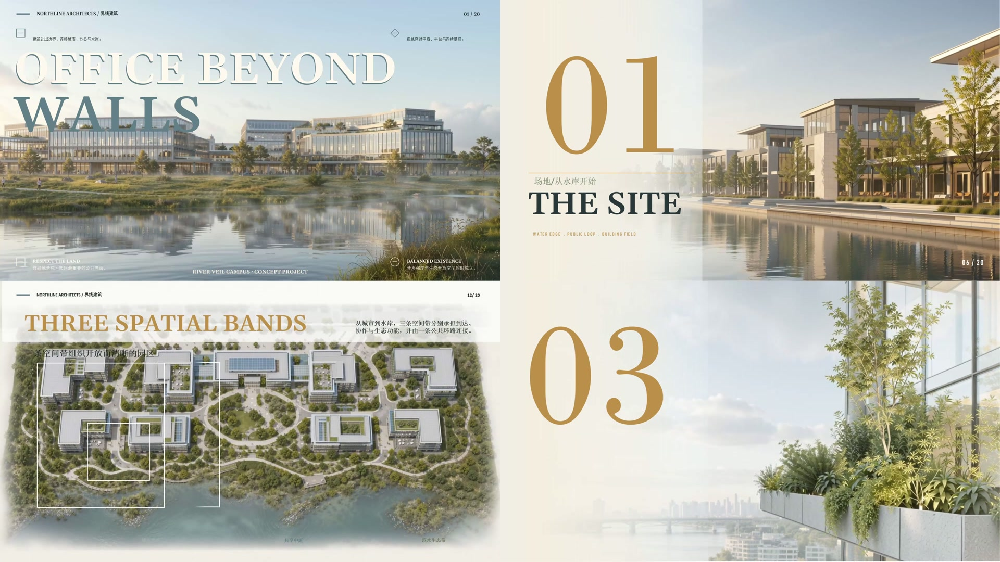
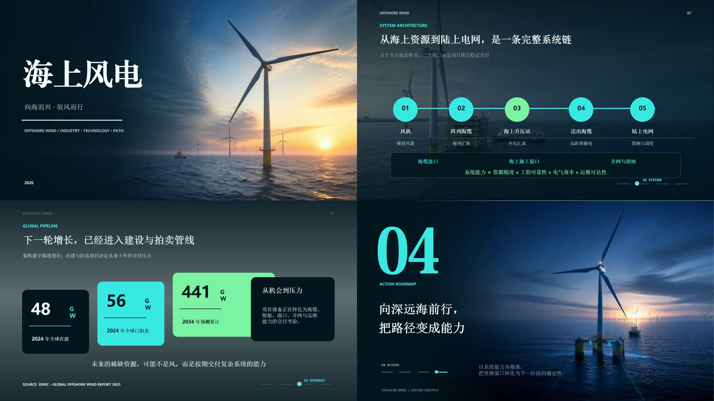
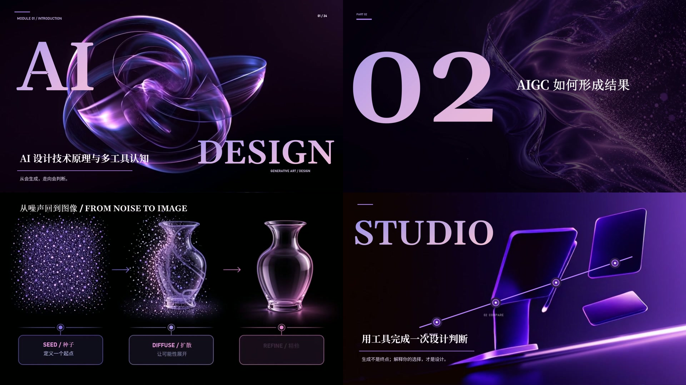
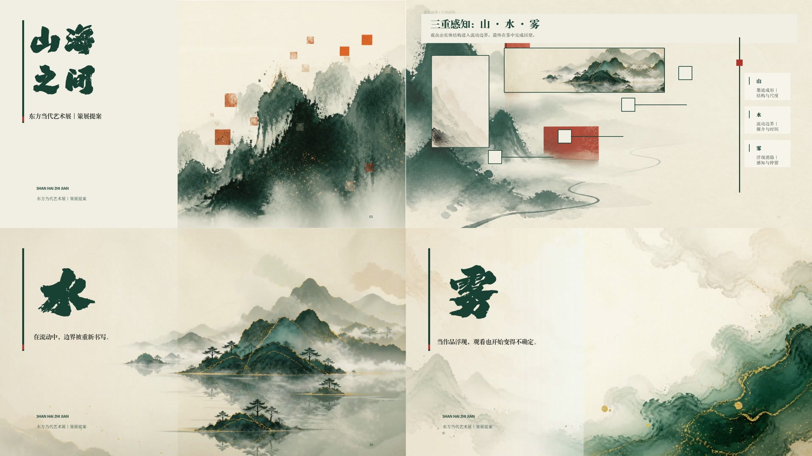

# 动态 PPT 视频案例

案例来自作者提供的四个 MP4 文件，原始视频保存在 GitHub Release 附件中。

以下为作者提供的四个动态 PPT 视频案例。下方预览均直接截取自对应视频，每张拼图展示四个时间点的实际画面。点击图片或链接下载原始 MP4，可使用浏览器或本地播放器观看完整演示。

### 1 · 云岸总部园区

[下载 / 观看完整视频：云岸总部园区](https://github.com/cchhm8888-ctrl/ppt-ing/releases/download/video-cases/yun-an-headquarters.mp4)

文件：`01_云岸总部园区.mp4` · MP4 · 265.9 MiB。

### 2 · 海上风电 · 22 页

[下载 / 观看完整视频：海上风电 · 22 页](https://github.com/cchhm8888-ctrl/ppt-ing/releases/download/video-cases/offshore-wind-22-slides.mp4)

文件：`03海上风电_动态PPT_22页_编辑层舒缓统一节奏版.mp4` · MP4 · 176.2 MiB。

### 3 · AI 设计导论

[下载 / 观看完整视频：AI 设计导论](https://github.com/cchhm8888-ctrl/ppt-ing/releases/download/video-cases/introduction-to-ai-design.mp4)

文件：`AI设计导论.mp4` · MP4 · 279.6 MiB。

### 4 · 山海之间 · 东方当代艺术展

[下载 / 观看完整视频：山海之间 · 东方当代艺术展](https://github.com/cchhm8888-ctrl/ppt-ing/releases/download/video-cases/shanhai-art-exhibition.mp4)

文件：`山海之间_东方当代艺术展_动效同步加强版.mp4` · MP4 · 171.4 MiB。

[查看全部视频附件](https://github.com/cchhm8888-ctrl/ppt-ing/releases/tag/video-cases) · [返回仓库使用指南](../README.md)

视频保留原始文件，不附带项目 PPTX。MP4 展示播放效果，可编辑对象需要查看对应 PPTX。

截图按左上、右上、左下、右下排序；源视频、时长和截图时间记录在 [frame-sources.json](frame-sources.json)。
